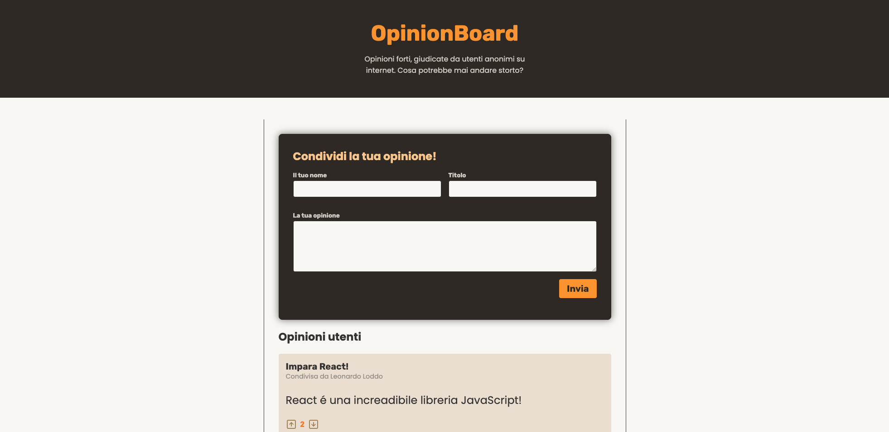

# Opinion Board 💬

**Opinion Board** è un’applicazione React che permette agli utenti di scrivere opinioni e interagire con quelle degli altri tramite upvote e downvote.  
Ogni opinione include un titolo, un contenuto e il nome dell’autore. L’interfaccia è semplice e diretta, pensata per stimolare confronto e partecipazione.



## Tecnologie utilizzate

- React
- React DOM
- Node.js
- Express
- useState (per la gestione dello stato locale)
- useReducer (per la gestione delle opinioni)
- useContext (per condividere funzioni e stato tra i componenti)
- formStatus (per tracciare lo stato del form e degli invii)
- React Server Actions (per la gestione asincrona dei dati)

## Installazione

Per eseguire il progetto in locale:

```bash
git clone https://github.com/leonardoLoddo/opinion-board
cd opinion-board
npm install
npm run dev
```

⚙️ Per attivare il backend Express, apri un **terminale separato** e segui questi comandi:

```bash
cd backend
npm install
node app.js
```

Il backend sarà attivo su `http://localhost:3000` (o sulla porta configurata).

## Autore

Leonardo Loddo – Web Dev e Docente di sviluppo
